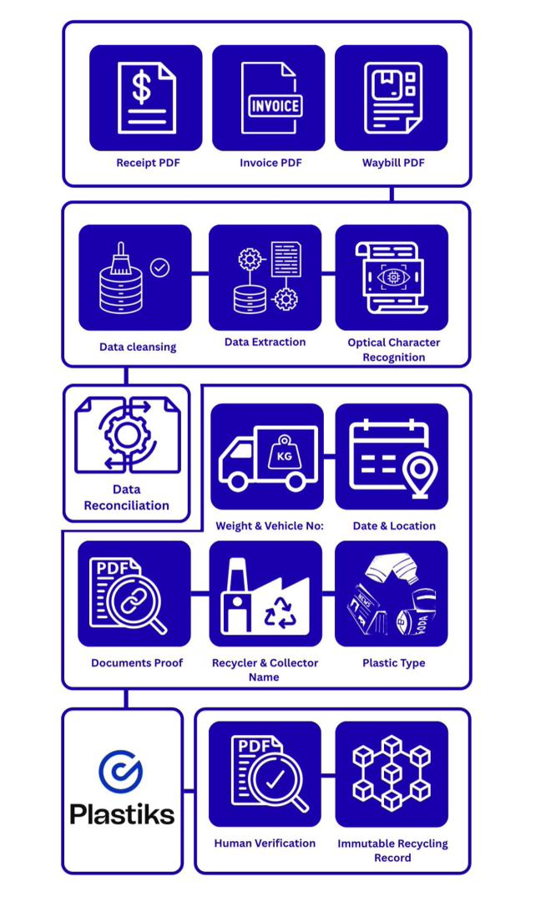

# Plastic Credits — Document Integrity Platform

**Turning plastic recovery into verifiable credits — 235,463 tonnes processed through the platform.**

## Overview

A platform that processes plastic-recovery documentation into verifiable credits. Every claim must trace back to source documents — invoices, EFT receipts, e-way bills — at volume, across languages and formats, without double-counting.

This platform is that trust layer.

## The Problem

Credit integrity lives or dies on document processing:

- High-volume ingestion of heterogeneous invoices/receipts/e-way bills from global collection sites
- Duplicate submission risk — the same recovery documented twice inflates credit claims
- Regulatory-grade verification trails requiring human review on flagged items
- Direct integration into the Plastiks credit-issuance pipeline

Off-the-shelf OCR pipelines solve reading, not *believing*.

## The Solution

A purpose-built document-integrity platform:

1. **Ingestion** — multi-format document capture with AI-powered extraction (Google Gemini 2.0 Flash)
2. **Smart Deduplication** — business-aware composite fingerprints (`invoice | weight | from | to | date | amount`) catch resubmissions even when formatting varies
3. **Business Rules Engine** — country-specific document requirements with smart recycler detection (domestic recyclers: 2 docs; international: 3)
4. **Human Verification** — flagged items route to reviewers with full context; every decision persisted
5. **Blockchain Integration** — verified credits pushed to Plastiks for on-chain issuance

## Impact

**Official reporting (07 Sep – 26 Sep 2025):**

| Metric | Value |
|---|---|
| Active Users | 7 |
| Total Credits | 14,984 |
| Compliant Credits | 14,530 |
| **Compliant Volume** | **235,463,000 KG** |
| Flagged Credits | 454 |
| Flagged Volume | 7,375,000 KG |

**235,463 tonnes of plastic recovery documented and verified through the platform.** No other public metrics claimed.

## My Role

Co-built with [@dime-git](https://github.com/dime-git) — backend/document-processing pipeline focus.

## Technology

Next.js 15 · React 19 · TypeScript · Supabase (Postgres + Auth + Storage) · Google Gemini 2.0 Flash · Plastiks Blockchain · Tailwind CSS · shadcn/ui

## Engineering Highlights

- **Business-meaningful dedup keys** instead of naive content hashes — robust against formatting variance, timezone drift, and field reordering
- **Smart recycler detection** — algorithm identifies domestic recyclers by company name, city, and business suffix to apply country-specific rules
- **Verification-first architecture** — automation proposes, humans dispose, ledger remembers
- **Postgres-side lifecycle tracking** with rollback migrations kept alongside forward ones

## Current Status

**Production** — ran the September 2025 claims campaign; codebase published here as the engineering artifact. Client-confidential data excluded.

## Lessons / What This Demonstrates

- Trust infrastructure for environmental markets is mostly document engineering, not blockchain theater
- Dedup design is adversarial design: assume someone will resubmit, reformat, and re-date
- Two people plus opinionated automation can process six-figure-tonnage campaigns
